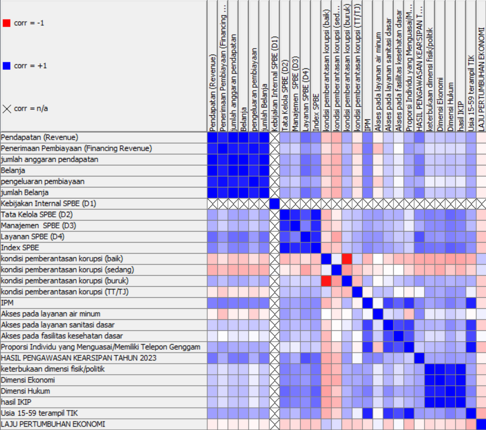
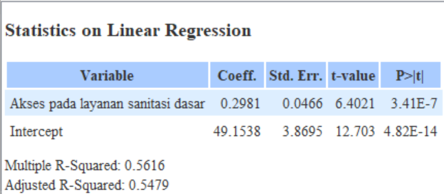

# 📊 Data Mining: Analisis Hubungan Layanan Sanitasi Dasar terhadap Peningkatan Indeks Pembangunan Manusia

Technical report ini adalah hasil analisis dari proses penambangan data yang berdasarkan pada data dari 34 provinsi di Indonesia pada tahun 2023. Penelitian ini bertujuan untuk mengeksplorasi sejauh mana akses layanan publik berkontribusi terhadap variasi index pembangunan manusia (IPM) antar provinsi. Dengan menggunakan pendekatan korelasional dan model regresi linier, penelitian ini menemukan adanya korelasi positif yang signifikan antara akses layanan sanitasi dasar dengan IPM. Provinsi-provinsi dengan tingkat akses sanitasi yang lebih tinggi cenderung memiliki IPM yang lebih baik. Hasil penelitian ini menunjukkan bahwa peningkatan akses dan kualitas layanan sanitasi dapat menjadi salah satu strategi efektif untuk memperbaiki IPM, khususnya di wilayah dengan akses sanitasi yang masih rendah. Penelitian ini dapat memberikan kontribusi penting dalam memberikan bukti empiris mengenai peran krusial sanitasi dalam pembangunan manusia di Indonesia. Selain itu, hasil penelitian ini diharapkan dapat memberikan wawasan bagi pembuat kebijakan dalam merumuskan intervensi yang lebih efektif dan tepat sasaran untuk meningkatkan IPM melalui perbaikan layanan sanitasi. Peningkatan akses sanitasi diharapkan dapat mendorong peningkatan kualitas hidup, kesehatan, dan pendidikan masyarakat, sehingga mendukung pembangunan berkelanjutan di Indonesia.

📌 **Dataset yang digunakan berasal dari Badan Pusat Statistik (BPS) Republik Indonesia**, mencakup data dari **34 provinsi di tahun 2023**.  

## 🚀 Tujuan Penelitian  
✅ **Mengidentifikasi hubungan akses sanitasi dasar dengan IPM**.  
✅ **Menganalisis korelasi antar variabel** menggunakan Pearson correlation.  
✅ **Membangun model regresi linier** untuk memprediksi IPM berdasarkan akses layanan sanitasi dasar.  
✅ **Mengevaluasi performa model prediksi** menggunakan metrik evaluasi.  

## 🔧 Tools yang Digunakan   
- **KNIME Analytics Platform** untuk pemrosesan data dan eksplorasi model. 

## 📊 Hasil Analisis  
### **1️⃣ Heatmap Korelasi Antar Atribut**  
Berikut adalah visualisasi **linear correlation** antar variabel dalam dataset:  

  

### **2️⃣ Regresi Linier: Akses Sanitasi Dasar vs IPM**  
Hasil analisis regresi menunjukkan hubungan positif antara akses sanitasi dasar dan IPM.  

📝 **Persamaan Regresi Linier:**  
\[ IPM = 0.298 \times (\text{Akses Sanitasi Dasar}) + 49.154 \]  

📈 **Visualisasi regresi linier:**  

  

### **3️⃣ Evaluasi Model Prediksi**  
Hasil evaluasi model regresi linier menunjukkan performa sebagai berikut:  

| **Metrik Evaluasi** | **Nilai** |
|----------------|---------|
| **R² (R-Squared)** | 0.562 |
| **Mean Absolute Error (MAE)** | 1.947 |
| **Mean Squared Error (MSE)** | 6.026 |
| **Root Mean Squared Error (RMSE)** | 2.455 |

📊 **Visualisasi metrik evaluasi model:**  

  

## 🏆 Kesimpulan  
Berdasarkan hasil analisis data dan model prediksi, dapat disimpulkan bahwa:  
🔹 **Terdapat korelasi positif** antara akses layanan sanitasi dasar dan IPM, dengan koefisien korelasi sebesar **0.749**.  
🔹 **Regresi linier menunjukkan bahwa setiap peningkatan 1% akses layanan sanitasi dasar meningkatkan IPM sebesar 0.298 poin**.  
🔹 **Nilai R² sebesar 0.562** menunjukkan bahwa model dapat menjelaskan sekitar **56.2% variasi dalam data IPM**, sementara sisanya dipengaruhi oleh faktor lain.  
🔹 **Provinsi dengan akses sanitasi yang lebih baik cenderung memiliki IPM yang lebih tinggi**, sedangkan provinsi dengan akses sanitasi rendah menunjukkan IPM yang lebih rendah.  
🔹 **Meskipun model ini cukup baik untuk memahami hubungan antara sanitasi dan IPM, ada variabel lain yang dapat mempengaruhi IPM**, seperti pendidikan, ekonomi, dan kesehatan masyarakat.  

Hasil penelitian ini menunjukkan bahwa **peningkatan akses layanan sanitasi dapat menjadi salah satu strategi efektif dalam meningkatkan IPM di Indonesia**, terutama di daerah dengan akses sanitasi yang masih terbatas.  

## 📂 Struktur Repository  
```
📁 dataset/         # Data publik dari BPS Indonesia  
📁 makalah/         # Technical report hasil data mining 
📁 knime/           # Workflow KNIME untuk pemrosesan data 
📁 images/          # Visualisasi hasil analisis   
📄 README.md        # Dokumentasi proyek  
```

## 📢 Sumber Data  
Dataset diambil dari **Badan Pusat Statistik (BPS) Republik Indonesia**, dapat diakses melalui:  
🔗 **[BPS - Badan Pusat Statistik (BPS) Republik Indonesia](https://www.bps.go.id/)**  


## 📜 Lisensi  
Proyek ini menggunakan **MIT License**.  

---
